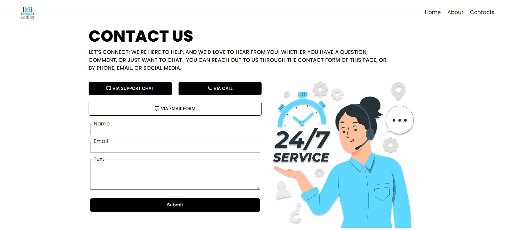

# Contact US Page

In this projects we will see followings concepts :

-   How to use css module
-   How to use react-icon
-   How to pass Props ( we can pass component , text , event listener as a props).
-   How useState() works

## Output

